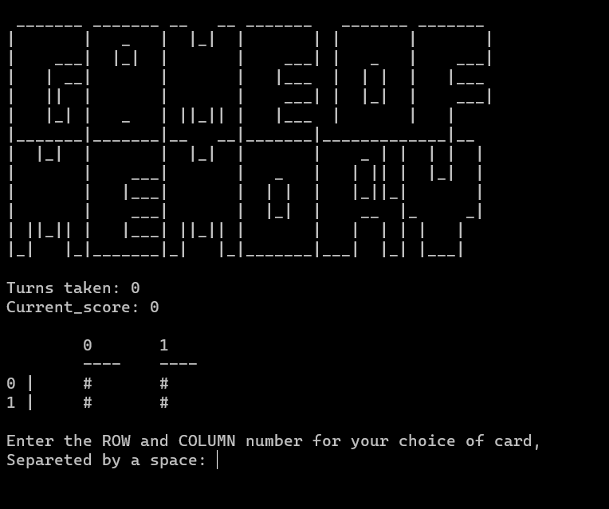

<!--
*** This is the Readme for the a simple game of memory 
-->

<!-- Project Shields -->

[![LinkedIn][linkedin-shield]][linkedin-url]

<!-- Project Logo -->
 

    <a href="https://github.com/aaguirre7/memory-game-python">
        
    <a/>
    <h3 align="center">
        Python simple memory game
    </h3>
    

        A quick an dirty Memory game to practice python
         
        <a href="https://github.com/aaguirre7/memory-game-python">
            <strong>Explore the docs</strong>
        </a>
         
         
        <a href="https://github.com/aaguirre7/memory-game-python">
            View the Code
        </a>
    

<!-- TABLE OF CONTENTS -->

  
Table of Contents

  <ol>
    <li>
      <a href="#about-the-project">About The Project</a>
    </li>
    <li>
        <a href="#contact">Contact</a>
    </li>

  </ol>

<!-- ABOUT THE PROJECT -->
## About The Game 

[![Product Name Screen Shot][product-screenshot]](./assets/images/memlogo.png)

It is a simple game of memory to try python tables, download the code and run it on your terminal.

Built on python3

Have a great day!

(<a href="#top">back to top</a>)

<!-- CONTACT -->
## Contact

Abraham Aguirre Aguirre.Abraham@gmail.com

Project Link: [https://github.com/aaguirre7/memory-game-python](https://github.com/aaguirre7/memory-game-python)

<!-- MARKDOWN LINKS & IMAGES -->
[linkedin-shield]: https://img.shields.io/badge/-LinkedIn-black.svg?style=for-the-badge&logo=linkedin&colorB=555
[linkedin-url]: https://www.linkedin.com/in/abraham-aguirre-1b237293/
[product-screenshot]: ./assets/images/screenshot.png